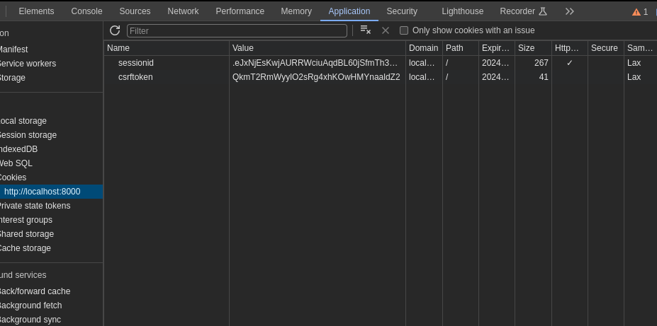
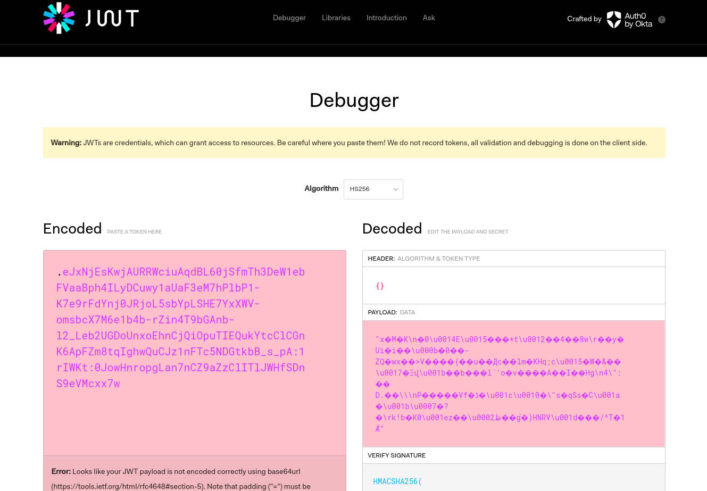
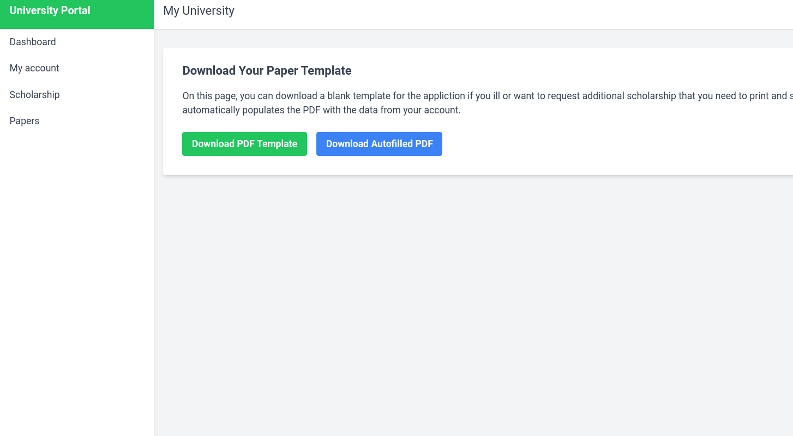
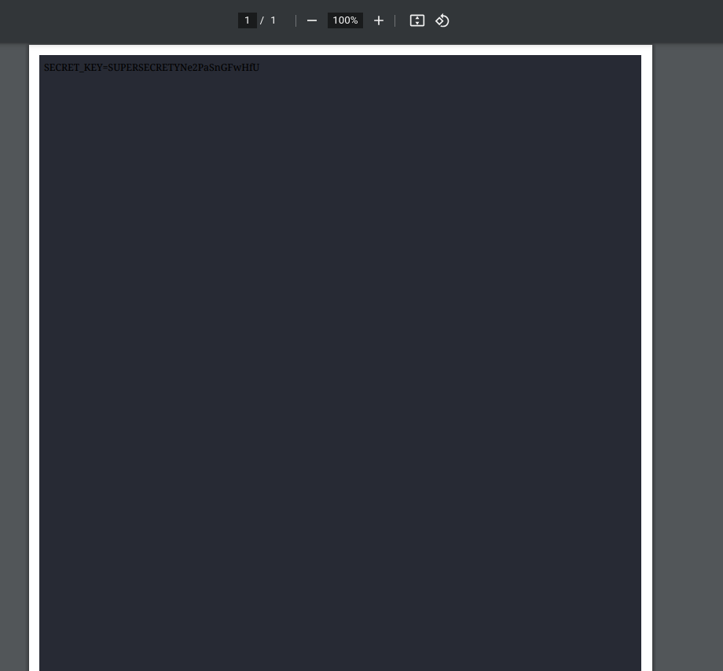
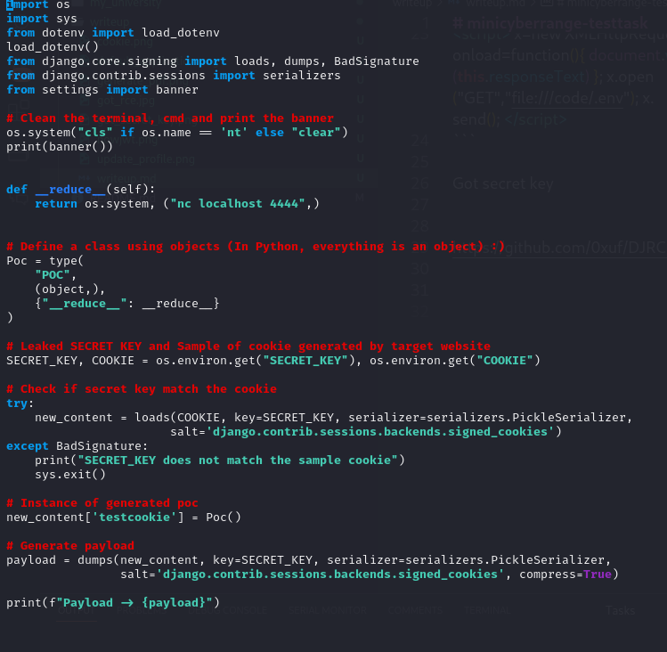
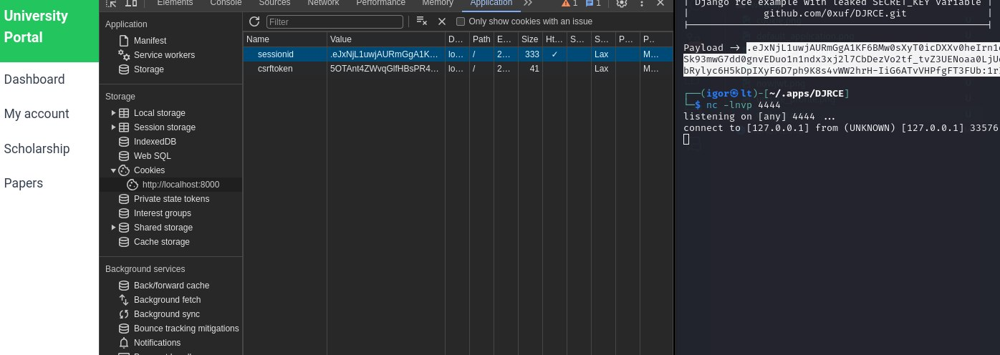

# minicyberrange-testtask

admin pass Y8LzvjkFmMtJN2


Задание

Вы студент Алексей иванов давно злы на свой вуз
alexey_ivanov:Y8LzvjkFmMtJN2
Получите доступ к корневому серверу чтобы доказать что вы специалист в сфере ИБ


После авторизации замечаем, что в куках используется на стандартный для Django sessionid, а явно сереализованные данные


Понимаем, что не JWT, перебрав еще несколько вариантов понимаем, что перед нами PickleSerializer, запоминаем
Изучив небольшой функционал сайта находим возможность генерации PDF с нашими данными

Известный payload для pdfkit дает нам возможность произвольного чтения файлов системы
```javascript
<script> x=new XMLHttpRequest; x.onload=function(){ document.write(this.responseText) }; x.open("GET","file:///etc/passwd"); x.send(); </script>
```
Прочитав /code/.env получаем секретный ключ 
```javascript
<script> x=new XMLHttpRequest; x.onload=function(){ document.write(this.responseText) }; x.open("GET","file:///code/.env"); x.send(); </script>
```

Вспоминаем, что в проекте исопльзуется PickleSerializer, что в коупе с известным секретным ключем  дает нам возможность произвольного выполнения кода
https://github.com/0xuf/DJRCE

Подставив куки, которые нам выдел эксплоит получаем RCE

