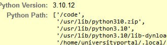

# minicyberrange-testtask

Задание

Вы студент Алексей иванов давно злы на свой вуз
alexey_ivanov:Y8LzvjkFmMtJN2
Получите доступ к корневому серверу чтобы доказать что вы специалист в сфере ИБ

WriteUp
Сразу замечаем, что включен режим отладки DEBUG = True, вызвав ошибку получаем информацию о расположении кода: /code



После авторизации замечаем, что в куках используется на стандартный для Django sessionid, а явно сереализованные данные


Понимаем, что не JWT, перебрав еще несколько вариантов понимаем, что перед нами PickleSerializer, запоминаем
Изучив небольшой функционал сайта находим возможность генерации PDF с нашими данными

Известный payload для pdfkit дает нам возможность произвольного чтения файлов системы
```javascript
<script> x=new XMLHttpRequest; x.onload=function(){ document.write(this.responseText) }; x.open("GET","file:///etc/passwd"); x.send(); </script>
```
Прочитав /code/.env получаем секретный ключ 
```javascript
<script> x=new XMLHttpRequest; x.onload=function(){ document.write(this.responseText) }; x.open("GET","file:///code/.env"); x.send(); </script>
```

Вспоминаем, что в проекте исопльзуется PickleSerializer, что в коупе с известным секретным ключем  дает нам возможность произвольного выполнения кода
https://github.com/0xuf/DJRCE

Подставив куки, которые нам выдел эксплоит получаем RCE

Повышение привелегий:
```bash
find / -perm -4000 2>/dev/null
```

Обнаруживаем, что у исполняемого файла /usr/bin/cp есть SUID бит который позволяет выполнить его с правами владельца - то есть root 
Таким образом мы можем записывать любые файлы от суперпользователя
например, чтобы получить права root мы можеми сгенерировать shadow файл и скопировать его в /etc/shadow, изменив пароль любого пользователя 


Чтобы не допусать таких уязвимостей необходимо
1) Не использовать DEBUG режим в условиях продакшн
2) Использовать актуальные решения для хранения сессии, такие как sessionid или jwt токены
3) Валидировать все данные, передаваемые пользоваталем
4) При использовании функций, которые вызывают сторонние исполняемые файлы следить за корректностью их вызова (enable local files в нашем случае) и в целом уязвимостями самих модулей, так как и в pdfkit и в wkhtmltopdf были CVE, хоть и не в этом полигоне.
5) Проводить тестирование не только локального кода но и внешних интеграций
6) Следить за правами файлов на сервере